# COGNIFYZ
Python Development Internship Program
# 🐍 Python Development Internship Program– Cognifyz


## 📌 About the Project

This repository contains my **Python programming tasks completed as part of the Cognifyz training/internship program**.

The tasks are divided into two levels:

* **Level 1:** Basic Python programming concepts
* **Level 2:** Intermediate Python programming concepts

The projects helped me practice Python functions, conditional statements, loops, string manipulation, file handling, random number generation, and input validation.

---

# 🟢 LEVEL 1

## 📚 Level 1 Overview

Level 1 focuses on fundamental Python programming concepts.

### Tasks Completed

| Task   | Project                | Concepts Used                                  |
| ------ | ---------------------- | ---------------------------------------------- |
| Task 1 | String Reversal        | Strings, Functions, Slicing                    |
| Task 2 | Temperature Conversion | Functions, Conditions, Mathematical Operations |
| Task 3 | Email Validator        | Strings, Validation, Conditions                |
| Task 4 | Calculator Program     | Functions, Operators, Conditions, Loops        |
| Task 5 | Palindrome Checker     | Strings, Functions, Slicing                    |

---

## 🔹 Level 1 – Task 1: String Reversal

### 📌 Description

The String Reversal program takes a string from the user and returns the string in reverse order.

For example:

```text
Input:  hello
Output: olleh
```

### 🛠️ Concepts Used

* Python functions
* String slicing
* User input
* String manipulation

### ▶️ Sample Output

```text
========================================
        STRING REVERSAL PROGRAM
========================================

Enter a string: hello

Original String : hello
Reversed String : olleh

Program completed successfully.
```

### 📸 Screenshot

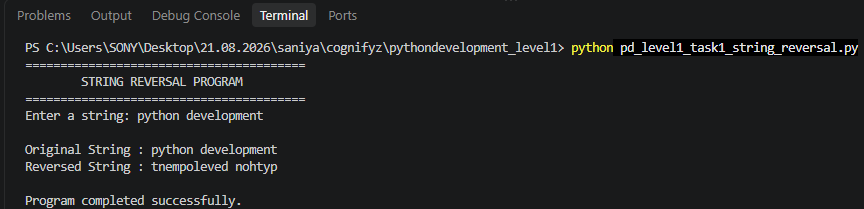

---

## 🔹 Level 1 – Task 2: Temperature Conversion

### 📌 Description

This program converts temperatures between **Celsius and Fahrenheit**.

The user can continuously perform conversions until they choose **Exit**.

### 🔄 Conversions

**Celsius to Fahrenheit:**

```text
Fahrenheit = (Celsius × 9/5) + 32
```

**Fahrenheit to Celsius:**

```text
Celsius = (Fahrenheit - 32) × 5/9
```

### 🛠️ Concepts Used

* Functions
* Mathematical operations
* `if`, `elif`, `else`
* `while` loop
* User input
* Exception handling

### ▶️ Sample Output

```text
========================================
       TEMPERATURE CONVERSION
========================================

1. Celsius to Fahrenheit
2. Fahrenheit to Celsius
3. Exit

Enter your choice: 1
Enter temperature in Celsius: 25

Celsius     : 25.0 °C
Fahrenheit  : 77.0 °F

Enter your choice: 2
Enter temperature in Fahrenheit: 98.6

Fahrenheit  : 98.6 °F
Celsius     : 37.0 °C

Enter your choice: exit

Thank you for using the program!
```

### 📸 Screenshot

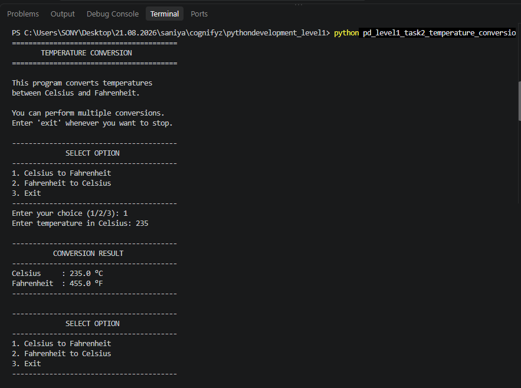

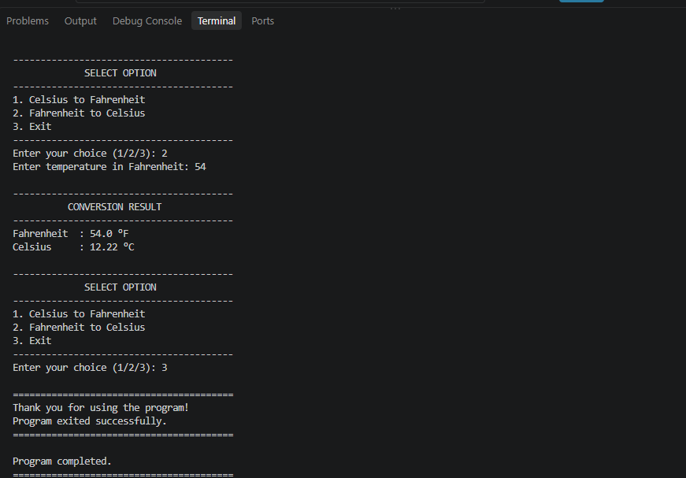


---

## 🔹 Level 1 – Task 3: Email Validator

### 📌 Description

The Email Validator checks whether an email address follows a basic valid format.

The program checks:

* Presence of `@`
* Valid username
* Domain name
* Presence of `.`
* Invalid spaces
* Correct domain structure

### 🛠️ Concepts Used

* Functions
* String methods
* Conditional statements
* Input validation
* String manipulation

### ▶️ Sample Output

```text
========================================
          EMAIL VALIDATOR
========================================

Email Address: student@gmail.com

----------------------------------------
Email Validation Result
----------------------------------------
Email : student@gmail.com
Status: VALID
----------------------------------------
```

### 📸 Screenshot

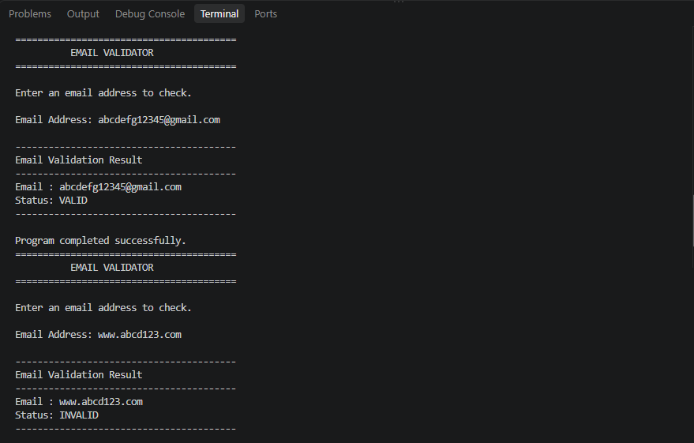

---

## 🔹 Level 1 – Task 4: Calculator Program

### 📌 Description

The Calculator program performs basic mathematical operations.

Supported operations:

* Addition `+`
* Subtraction `-`
* Modulo `%`

The calculator continues running until the user enters **exit**.

### 🛠️ Concepts Used

* Functions
* Arithmetic operators
* `if-elif-else`
* `while` loop
* User input
* Exception handling

### ▶️ Sample Output

```text
========================================
           BASIC CALCULATOR
========================================

Available Operations:
+  Addition
-  Subtraction
%  Modulo

Enter the first number: 20
Enter the second number: 5
Enter operator (+, -, %): +

----------------------------------------
          CALCULATION RESULT
----------------------------------------
20.0 + 5.0 = 25.0
----------------------------------------

Press Enter to continue or type 'exit' to stop: exit

Thank you for using calculator!
```

### 📸 Screenshot

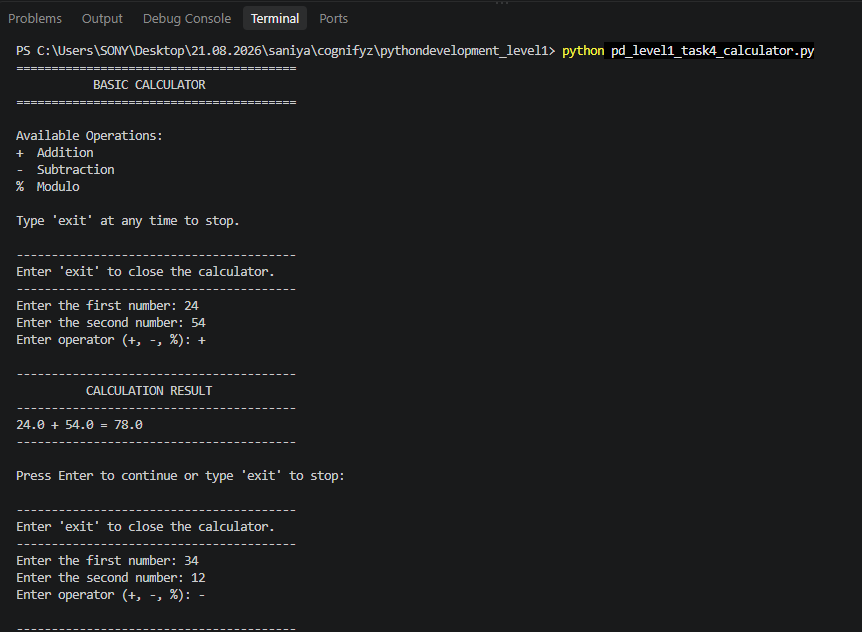


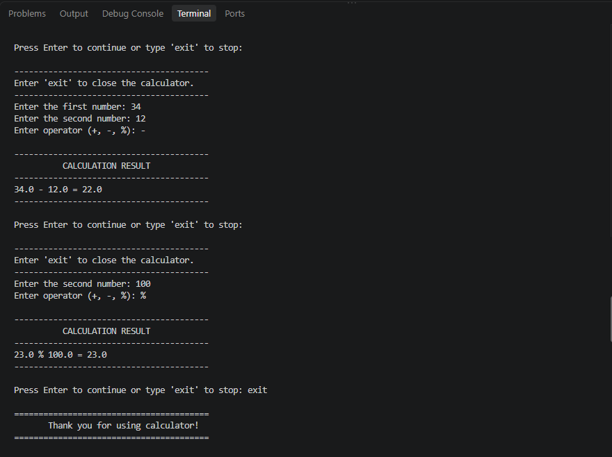

---

## 🔹 Level 1 – Task 5: Palindrome Checker

### 📌 Description

The Palindrome Checker determines whether a word or phrase reads the same forward and backward.

Examples:

```text
madam → Palindrome
racecar → Palindrome
hello → Not a Palindrome
```

### 🛠️ Concepts Used

* Functions
* Strings
* String slicing
* Loops and conditions
* User input

### ▶️ Sample Output

```text
========================================
         PALINDROME CHECKER
========================================

Enter a word or phrase: madam

----------------------------------------
Palindrome Result
----------------------------------------
Original Text : madam
Result        : PALINDROME
The text reads the same backward.
----------------------------------------
```

### 📸 Screenshot

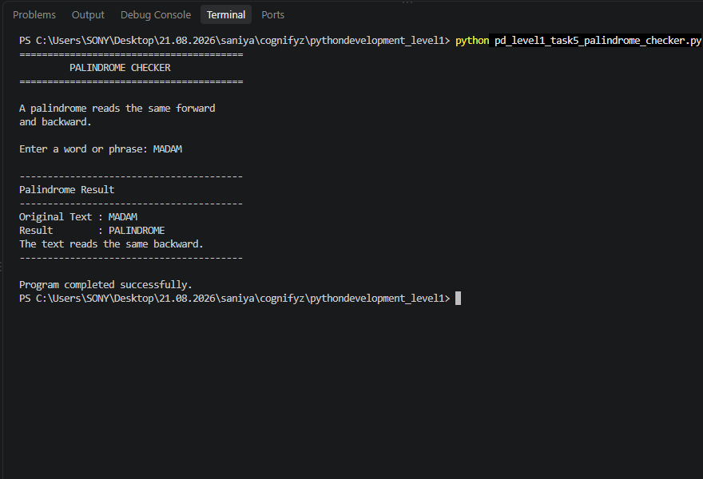

---

# 🔵 LEVEL 2

## 📚 Level 2 Overview

Level 2 introduces more practical Python programming concepts such as random number generation, password validation, sequences, loops, dictionaries, and file handling.

### Tasks Completed

| Task   | Project                   | Concepts Used                     |
| ------ | ------------------------- | --------------------------------- |
| Task 1 | Guessing Game             | Random, Loops, Conditions         |
| Task 2 | Number Guesser            | Random, User-defined Range, Loops |
| Task 3 | Password Strength Checker | Strings, Validation, Conditions   |
| Task 4 | Fibonacci Sequence        | Functions, Loops, Sequences       |
| Task 5 | File Manipulation         | Files, Dictionaries, Sorting      |

---

## 🔹 Level 2 – Task 1: Guessing Game

### 📌 Description

The Guessing Game generates a random number between **1 and 100**.

The user keeps guessing until the correct number is found.

The program provides hints:

* **Too Low**
* **Too High**
* **Correct**

It also counts the number of attempts.

### 🛠️ Concepts Used

* `random` module
* `random.randint()`
* Functions
* `while` loop
* Conditional statements
* Exception handling

### ▶️ Sample Output

```text
========================================
          NUMBER GUESSING GAME
========================================

I have selected a number between 1 and 100.
Try to guess the number!

Enter your guess: 50
Too High! Try a lower number.

Enter your guess: 25
Too Low! Try a higher number.

Enter your guess: 32

========================================
          CONGRATULATIONS!
========================================

You guessed the correct number!
Secret Number : 32
Attempts      : 3
```

### 📸 Screenshot

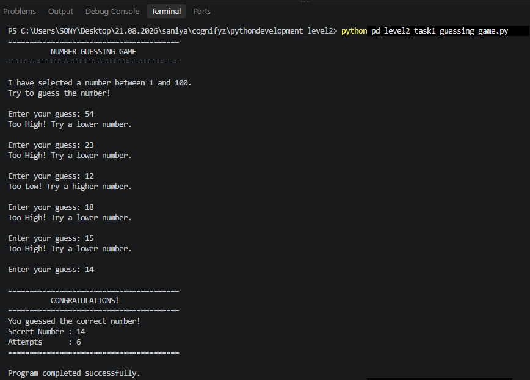

---

## 🔹 Level 2 – Task 2: Number Guesser

### 📌 Description

The Number Guesser allows the user to specify a custom range.

For example:

```text
Minimum: 1
Maximum: 500
```

The program randomly selects a number from the specified range.

The user then tries to guess the number.

### 🛠️ Concepts Used

* `random` module
* Random number generation
* Functions
* User-defined ranges
* Loops
* Conditional statements

### ▶️ Sample Output

```text
========================================
        CUSTOM NUMBER GUESSER
========================================

Enter the minimum number: 1
Enter the maximum number: 50

========================================
            NUMBER GUESSER
========================================

I have selected a number between 1 and 50

Enter your guess: 20
Too Low!

Enter your guess: 40
Too High!

Enter your guess: 35
Too Low!

Enter your guess: 37

----------------------------------------
             YOU WON!
----------------------------------------
Correct Number : 37
Total Attempts : 4
----------------------------------------
```

### 📸 Screenshot

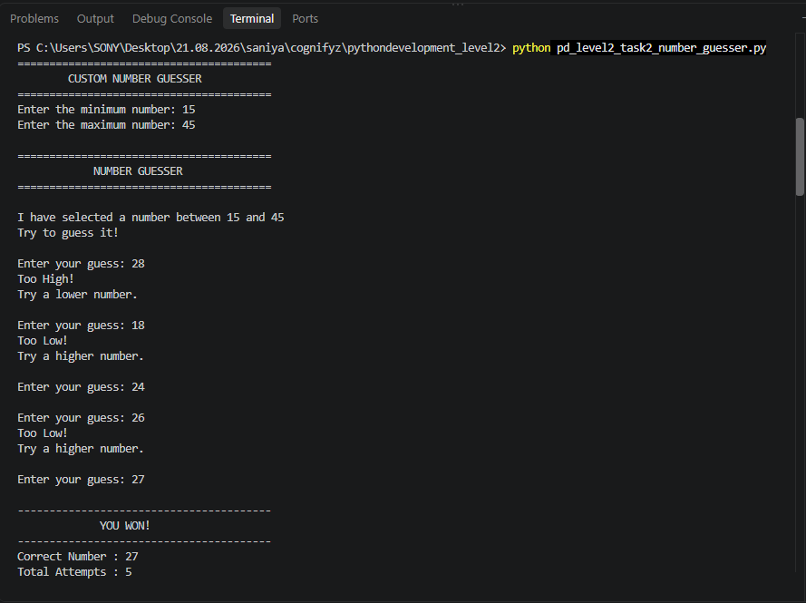

---

## 🔹 Level 2 – Task 3: Password Strength Checker

### 📌 Description

The Password Strength Checker evaluates a password based on different security requirements.

The program checks for:

* Minimum length
* Uppercase letters
* Lowercase letters
* Numbers
* Special characters

The password receives a score out of **5**.

### 🔐 Password Strength Levels

| Score | Strength    |
| ----- | ----------- |
| 0–1   | Very Weak   |
| 2     | Weak        |
| 3     | Medium      |
| 4     | Strong      |
| 5     | Very Strong |

### 🛠️ Concepts Used

* String manipulation
* `isupper()`
* `islower()`
* `isdigit()`
* `any()`
* Functions
* Conditional statements

### ▶️ Sample Output

```text
========================================
       PASSWORD STRENGTH CHECKER
========================================

Enter your password: Hello@123

----------------------------------------
       PASSWORD CHECK RESULT
----------------------------------------
Password Strength : VERY STRONG
Security Score    : 5/5
----------------------------------------

Excellent!
Your password satisfies all checks.
```

### 📸 Screenshot


---

## 🔹 Level 2 – Task 4: Fibonacci Sequence

### 📌 Description

The Fibonacci program generates the Fibonacci sequence based on the number of terms entered by the user.

The Fibonacci sequence starts with:

```text
0 1 1 2 3 5 8 13 21 34 ...
```

Each number is calculated by adding the previous two numbers.

### 🛠️ Concepts Used

* Functions
* `for` loop
* Variables
* Lists
* Mathematical operations
* User input

### ▶️ Sample Output

```text
========================================
         FIBONACCI SEQUENCE
========================================

Enter the number of terms: 10

----------------------------------------
Fibonacci Sequence
----------------------------------------
0 1 1 2 3 5 8 13 21 34
----------------------------------------

Number of Terms : 10
```

### 📸 Screenshot

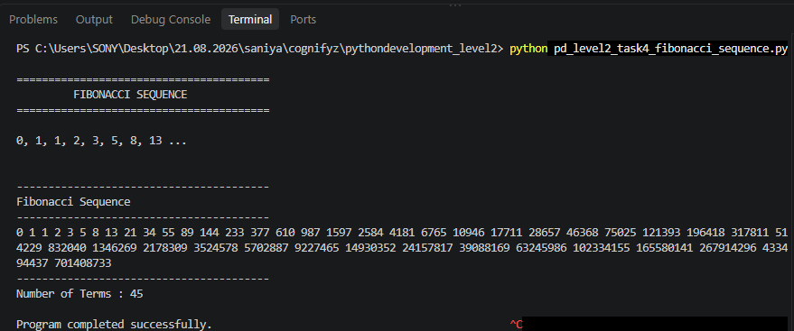

---

## 🔹 Level 2 – Task 5: File Manipulation

### 📌 Description

The File Manipulation program reads a text file and counts how many times each word occurs.

The results are displayed in **alphabetical order**.

### 📝 Example Input File

`sample.txt`

```text
Python is easy to learn.
Python is a popular programming language.
Learning Python is useful.
```

### 🛠️ Concepts Used

* File handling
* `open()`
* Reading text files
* Dictionaries
* Word counting
* Sorting
* Regular expressions

### ▶️ Sample Output

```text
========================================
       FILE MANIPULATION PROGRAM
========================================

Enter the text file name: sample.txt

----------------------------------------
       WORD FREQUENCY RESULTS
----------------------------------------
a                    : 1
easy                 : 1
is                   : 3
language             : 1
learn                : 1
learning             : 1
popular              : 1
programming          : 1
python               : 3
to                   : 1
useful               : 1
----------------------------------------

Total Unique Words : 11
```

### 📸 Screenshot

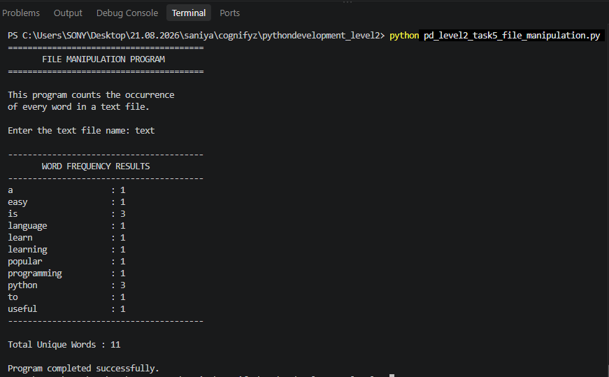

---

# 🧰 Technologies Used

* **Python 3**
* VS Code / PyCharm
* Python Standard Library
* Git
* GitHub

---

# 📖 Concepts Learned

Through these tasks, I practiced:

* Python functions
* Variables and data types
* User input
* Conditional statements
* `for` and `while` loops
* String manipulation
* String slicing
* Exception handling
* Random number generation
* Lists
* Dictionaries
* File handling
* Sorting
* Basic input validation

---

# 🚀 How to Run the Programs

## 1. Clone the Repository

```bash
git clone YOUR_GITHUB_REPOSITORY_URL
```

## 2. Open the Project

Open the project folder in **VS Code** or another Python IDE.

## 3. Open a Task Folder

For example:

```text
Level-1/Task-1-String-Reversal/
```

## 4. Run the Python Program

```bash
python task1_string_reversal.py
```

For Level 2:

```bash
python task1_guessing_game.py
```

---


# 🎯 Conclusion

These Level 1 and Level 2 tasks provided practical experience in Python programming and helped strengthen my understanding of programming fundamentals and problem-solving.

The projects demonstrate my ability to create interactive Python programs using functions, loops, conditions, string operations, random number generation, password validation, Fibonacci sequences, and file manipulation.

---

# 👩‍💻 Author

**Saniya Banu**


---


